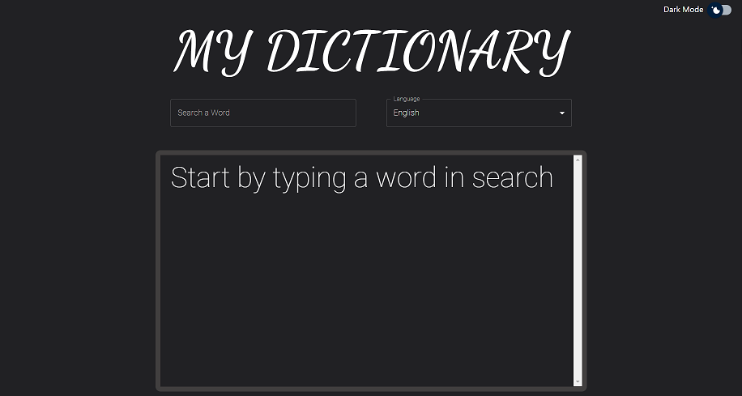
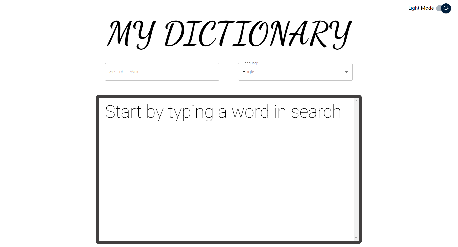
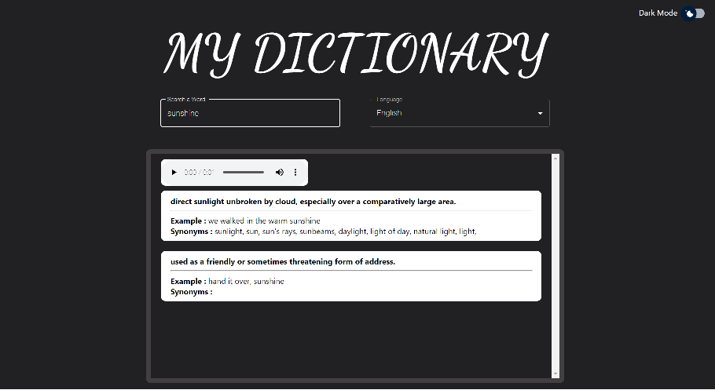

# Dictionary App using React

A simple **Dictionary App** using **React** and **Material UI** written in javascript which provides information/meaning about the searched word. It fetches information from Dictionary Api (https://dictionaryapi.dev/) and supports about 8 languages.

## FUNCTIONALITY

---

### The default theme of the app is **Dark Mode**

- Here's the sample picture:

- **Light Mode**:

### **It gives the meaning of searched word and also the audio pronounciation of the word(if supported).**

- Here's the demo:

---

## Problems to fix :-

- Audio functionality is not available for all words

## How to Deploy:

---

### 1. Copy the following link to deploy:

https://search-word.netlify.app/

### 2. Second method is:

- Fork and Clone
- Run **_npm start_** at the terminal
- the app will be deployed in the browser
